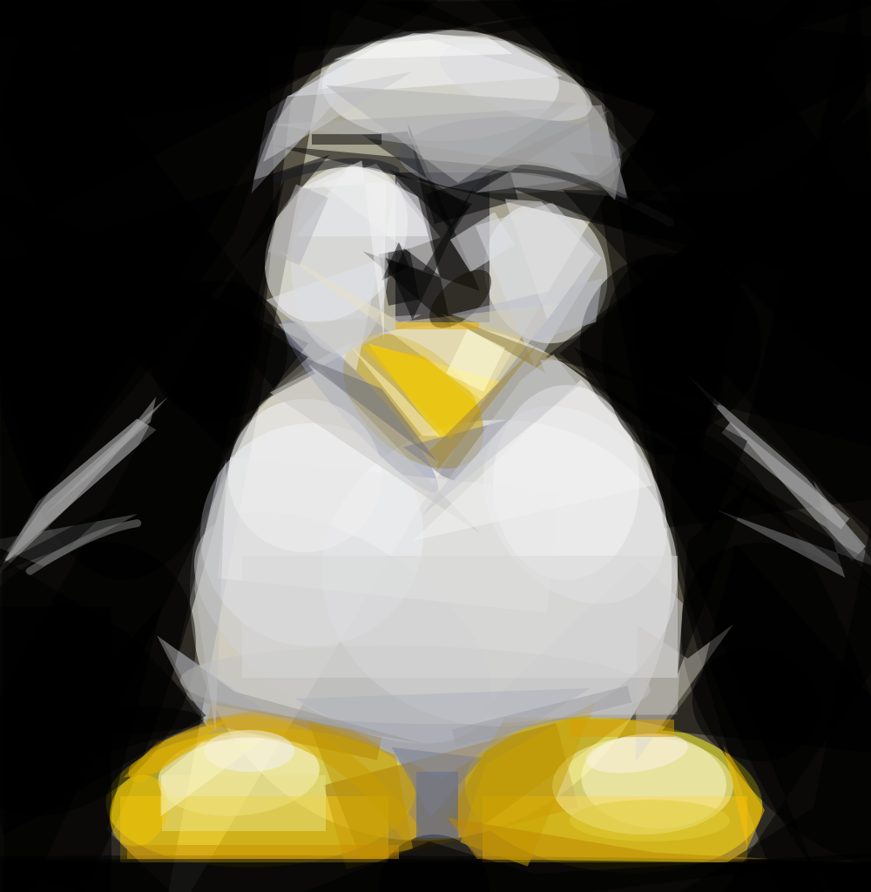
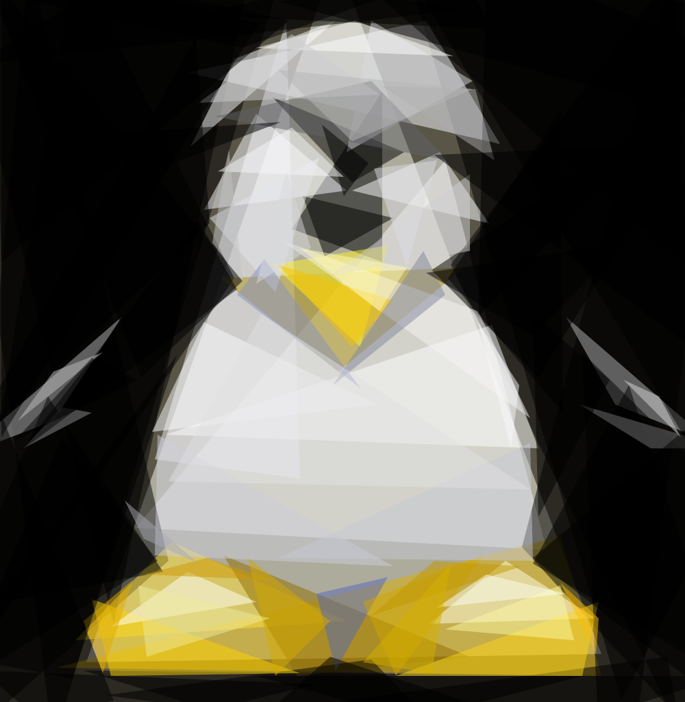
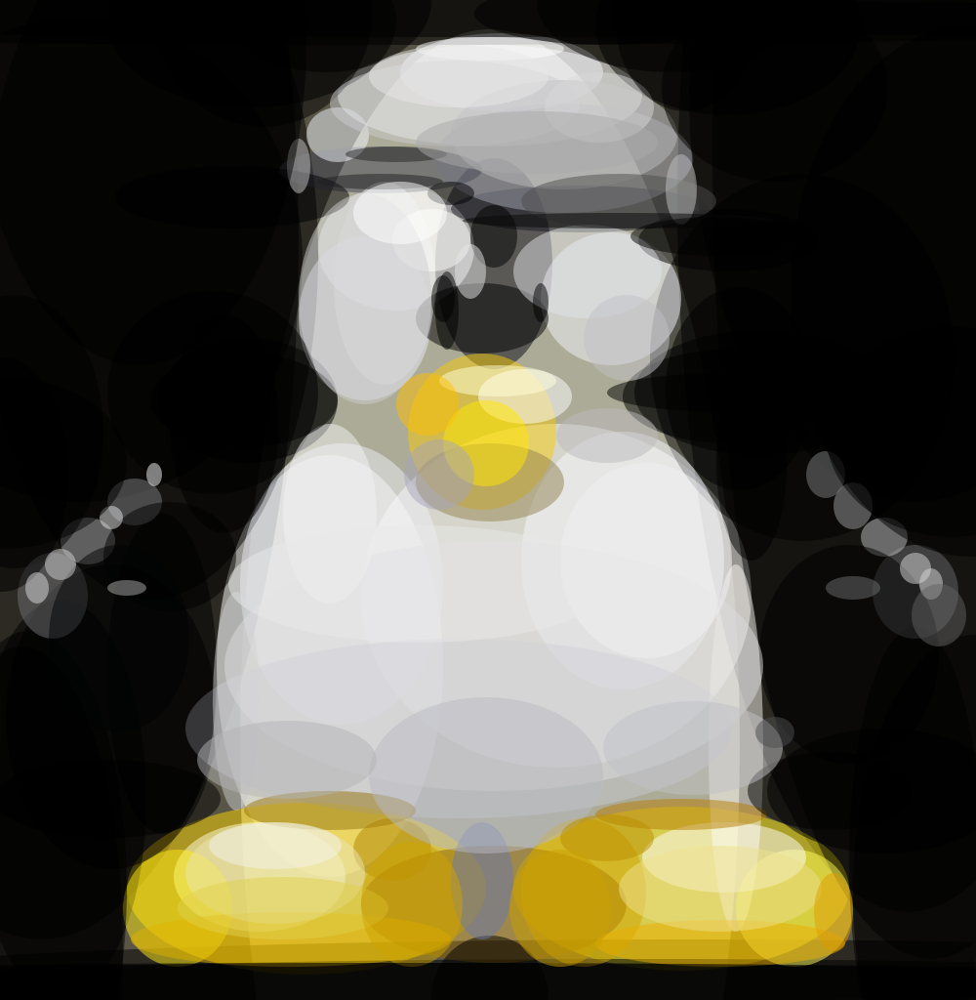
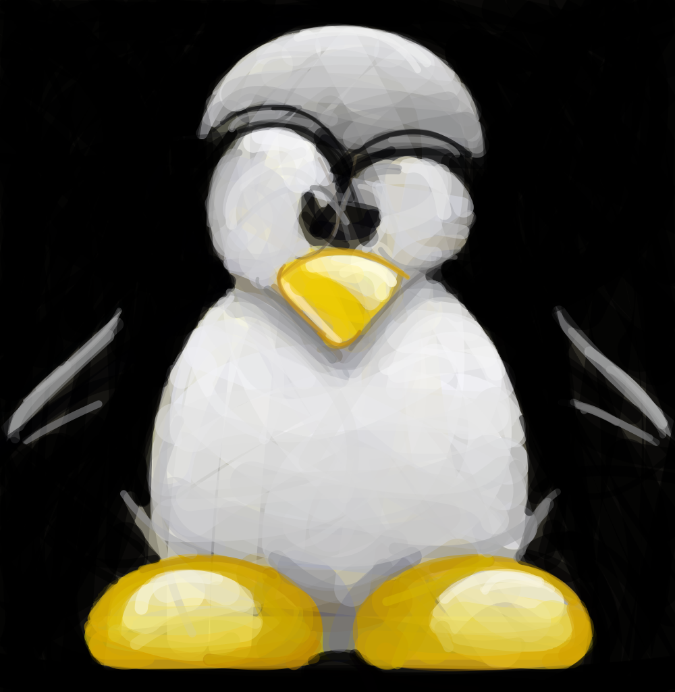
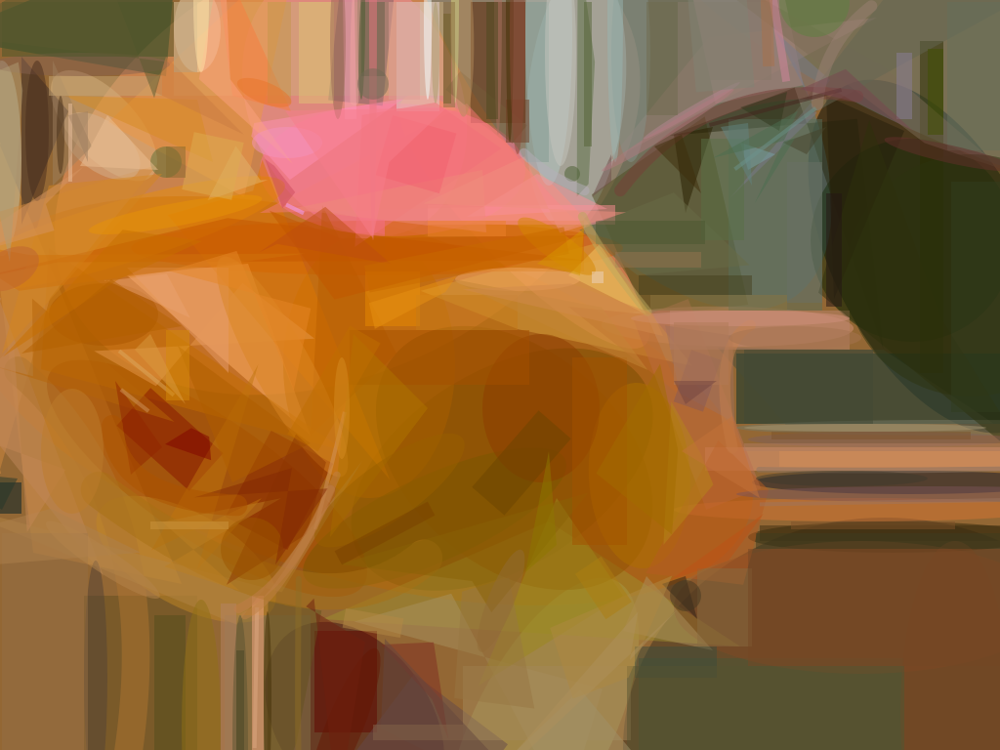
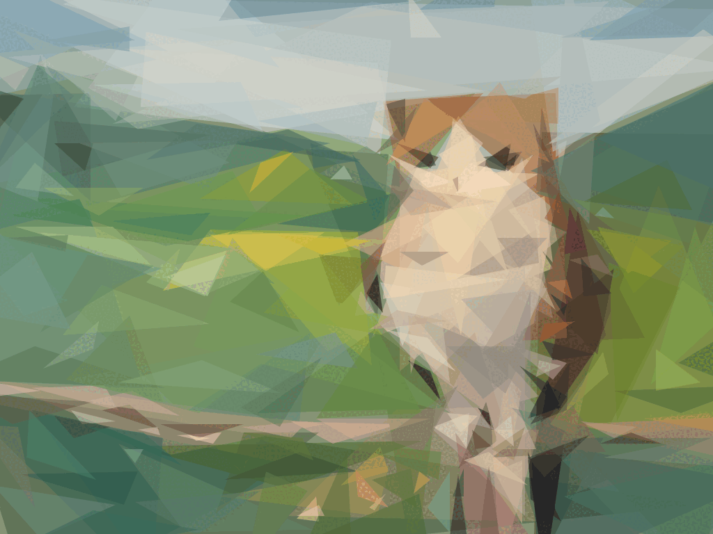

# primitive-rs

Reproduce images with geometric primitives, in Rust.



The same picture, built from 100 triangles:



Give it a photo and it rebuilds the picture one shape at a time, each time
picking the single shape that most reduces the error between the target and
what has been drawn so far. Around 50 to 200 shapes are usually enough to reach
something recognizable yet abstract.

## How it works

Start with a flat canvas filled with the target's average color. Then, in a
loop:

1. **Search** for the best shape. Several workers run in parallel; each tries a
   batch of random shapes, hill-climbs the best one, and the lowest-energy
   shape across all workers wins.
2. **Commit** it. The optimal color for the pixels it covers is solved
   directly (not searched), the shape is blended in, and the score is updated
   by re-scoring only the pixels that changed.

Repeat for as many shapes as you want. The score is the root-mean-square error
between the target and the reconstruction, so it only ever goes down.

The shapes are generated randomly and refined by [hill
climbing](https://en.wikipedia.org/wiki/Hill_climbing) (mutate a vertex, a
radius, an angle, or the alpha; keep the move if it improves the score,
otherwise roll back). [Simulated
annealing](https://en.wikipedia.org/wiki/Simulated_Annealing) is also
implemented, but in practice hill-climbing several random starts is just as
good and faster.

## Building

```bash
cargo build            # debug
cargo build --release  # optimized
```

## Running

```bash
# 100 triangles, 1024px output
cargo run --release -- -i input.png -o output.png -n 100

# combo mode, 150 shapes
cargo run --release -- -i input.png -o output.png -n 150 -m 0

# bezier strokes with 2 extra shapes per iteration
cargo run --release -- -i input.png -o output.png -n 50 -m 6 -rep 2
```

Use a small input image (around 256px); the detail is not needed and the run
is much faster.

### Flags

| Flag         | Default | Description                                                                                                             |
| ------------ | ------- | ----------------------------------------------------------------------------------------------------------------------- |
| `-i`         | n/a     | input file (required)                                                                                                   |
| `-o`         | n/a     | output file, may be repeated (required)                                                                                 |
| `-n`         | n/a     | number of shapes, may be repeated (required)                                                                            |
| `-m`         | `1`     | mode: `0`=combo `1`=triangle `2`=rect `3`=ellipse `4`=circle `5`=rotatedrect `6`=beziers `7`=rotatedellipse `8`=polygon |
| `-a`         | `128`   | color alpha (`0` lets the algorithm choose)                                                                             |
| `-r`         | `256`   | resize large input images to this size                                                                                  |
| `-s`         | `1024`  | output image size                                                                                                       |
| `-j`         | `0`     | number of parallel workers (`0` = all cores)                                                                            |
| `-bg`        | avg     | background color (hex); default is the image average                                                                    |
| `-nth`       | `1`     | save every Nth frame (put `%d` in the output path)                                                                      |
| `-rep`       | `0`     | add N extra shapes per iteration with reduced search                                                                    |
| `-v` / `-vv` | off     | verbose / very verbose                                                                                                  |

### Output formats

The format is inferred from the `-o` extension:

- `.png` / `.jpg` : raster output
- `.svg` : vector output
- `.gif` : animated output showing the shapes being added (requires ImageMagick)

A path containing `%d` (or `%03d`, etc.) saves a frame every `-nth` shapes,
substituting the frame number. You can pass `-o` multiple times to write
several formats at once.

## Web demo

There is an optional web server that lets anyone upload a picture and watch it
get drawn, one shape at a time, streamed as SVG over Server-Sent Events.

```bash
cargo run --release --features web --bin primitive-web
# then open http://localhost:6123
```

It is packaged as a container:

```bash
docker compose up --build
```

The server runs one job at a time (each run saturates the CPU), keeps a small
bounded queue, and caps the output size, so it stays well-behaved under load.
Set `PRIMITIVE_WORKERS` to limit how many cores a run may use.

## Examples

More from the same pipeline:

| Combo                        | Triangles                            |
| ---------------------------- | ------------------------------------ |
|  |  |

| Ellipses                           | Bezier strokes                   |
| ---------------------------------- | -------------------------------- |
|  |  |

| Rose (combo)                 | Progression (GIF)                  |
| ---------------------------- | ---------------------------------- |
|  |  |

### Static animation

Because each run uses a different random seed, the same input produces several
slightly different reconstructions. Playing them as a GIF brings a static
picture to life:



## Testing

```bash
cargo test                     # unit + integration tests
cargo clippy --all-targets     # lint
cargo fmt --check              # format check
```

## Repository layout

```
src/
├── lib.rs          # crate root
├── main.rs         # CLI entry point
├── web.rs          # optional web demo (feature `web`)
├── color.rs        # Color, hex parsing
├── scanline.rs     # Scanline, crop_scanlines
├── util.rs         # math helpers + image I/O
├── log.rs          # log level + log/v/vv/vvv
├── heatmap.rs      # Heatmap (error accumulation)
├── core.rs         # compute_color, draw_lines, difference_full/partial
├── shape.rs        # Shape trait + ShapeType enum
├── triangle.rs     # Triangle
├── rectangle.rs    # Rectangle, RotatedRectangle
├── ellipse.rs      # Ellipse, RotatedEllipse
├── polygon.rs      # Polygon
├── quadratic.rs    # Quadratic (bezier stroke)
├── state.rs        # State (optimization state)
├── optimize.rs     # hill_climb, anneal, pre_anneal
├── worker.rs       # Worker (per-thread search state)
├── model.rs        # Model (drives the algorithm)
├── raster.rs       # anti-aliased gray rasterizer (fill + stroke)
└── context.rs      # 2D vector context: transform stack + AA fill/stroke
```

## License

MIT.

## Inspiration

This project is inspired by [fogleman/primitive](https://github.com/fogleman/primitive),
a Go tool by Michael Fogleman that does the same thing. This is a Rust
re-implementation of that idea, with its own structure and an added web demo.
